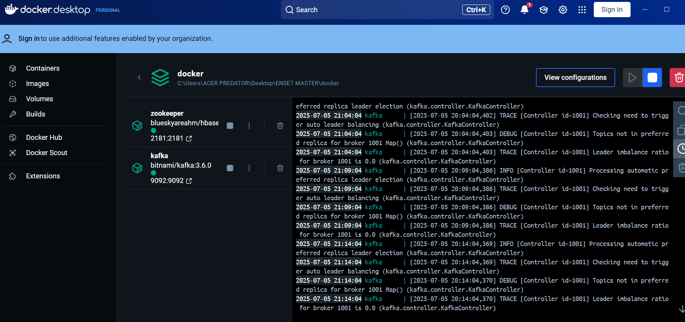
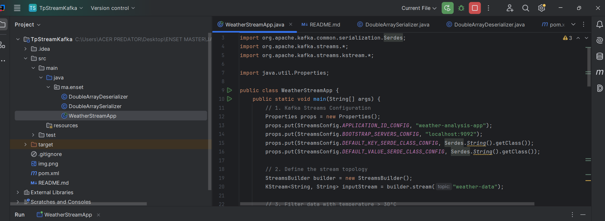
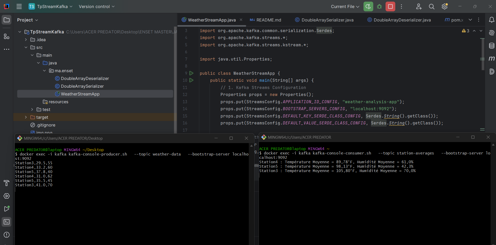

# 🌦️ WeatherStreamApp – Traitement de données météo en temps réel avec Kafka Streams

Cette application Kafka Streams (Java) permet de traiter des relevés météorologiques en temps réel : elle filtre les températures élevées, les convertit en Fahrenheit et affiche le résultat groupé avec le calcul d'humidité .

---

## ✅ Fonctionnalités

- 🔍 Filtrage des relevés où la température dépasse 30 °C
- 🌡️ Conversion des températures en Fahrenheit
- 💡 grouper les station et calculer le percentage d'humidité
- 🔄 Intégration Kafka via Docker Compose
- 💬 Affichage  dans topic station-averages


---
---
## 🧩 Structure du proje
``
src/
└── main/
 └── java/
   └── ma/
     └── enset/
          ├── WeatherStreamApp.java
          ├── DoubleArraySerializer.java
          └── DoubleArrayDeserializer.java
``
---

## 🔁 Flux de traitement

1. **Lecture des données** à partir du topic Kafka `weather-data`
2. **Filtrage** des relevés où Température > 30 °C
3. **Conversion** de la température en Fahrenheit
4. **Affichage** détaillé par message sur le topic `station-averages`

### Exemple de sortie dans `station-averages`
``
Station4 : Température Moyenne = 89,78°F, Humidité Moyenne = 61,0%
``
---

## 🚀 Démarrage

### 1. Démarrer Kafka avec Docker
```bash
docker-compose up -d
```

### 2.Créer les topics nécessaires :
```bash
docker exec kafka kafka-topics.sh --create --topic weather-data --bootstrap-server localhost:9092
docker exec kafka kafka-topics.sh --create --topic station-averages --bootstrap-server localhost:9092
```

### 3.Lancer l’application Java
- Exécuter WeatherStreamApp.java


### 4. Injecter des données de test
```bash
docker exec -i kafka kafka-console-producer.sh \
  --topic weather-data \
  --bootstrap-server localhost:9092
```
### 4.2 coller les donnes 
```bash
Station1,32.5,60
Station2,28.0,55  # ignoré
Station3,40.0,65
--
```

### 5.affichege de resultat final  apres les trois {Filtrage,Conversion,groupement}
```bash
docker exec -i kafka kafka-console-consumer.sh  
--topic station-averages   --bootstrap-server localhost:9092
```



👨‍💻 Auteur
Créé avec ☕ + 💡 par Ayman BOUBDIR
